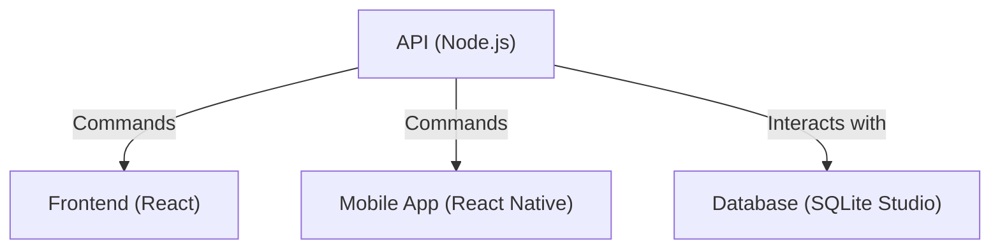
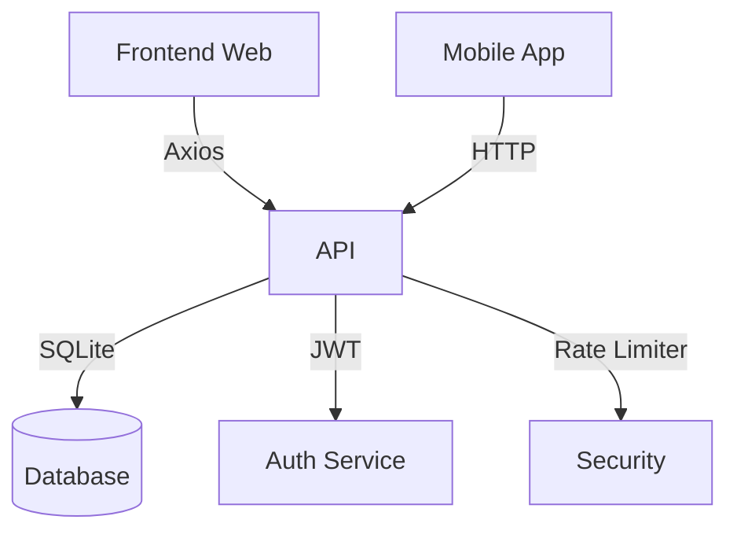
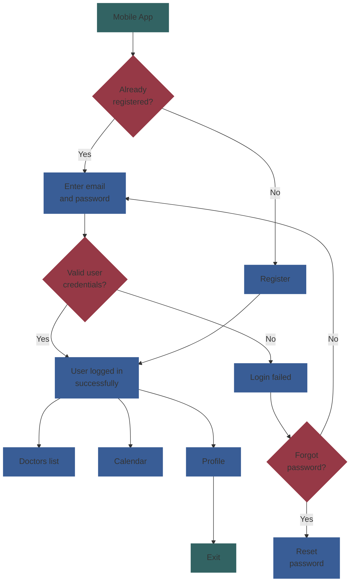
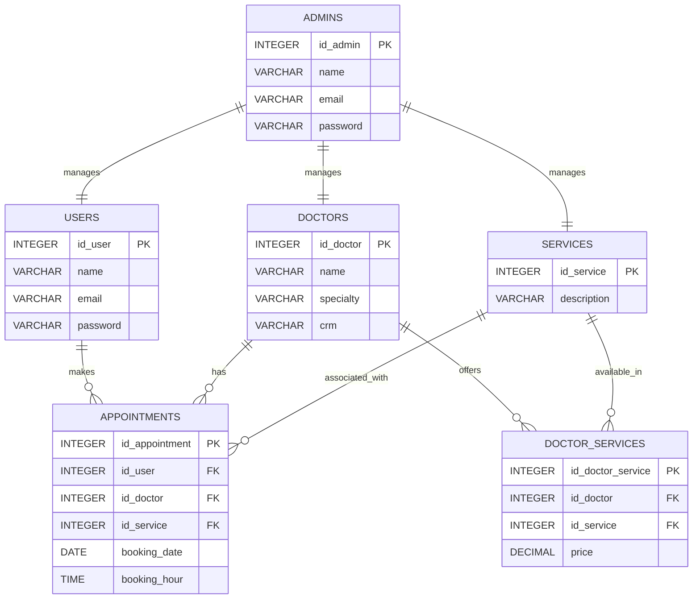

# Dragenda - Doctor Agenda - Medical Appointment Management

Digital healthcare revolutionizes the way we deliver and experience healthcare with a paradigm shift to more accessible, personalized and efficient approaches for all. **Dragenda** is an online version of the medical appointment management system, allowing patients to schedule, modify or cancel medical appointments effortlessly. By eliminating the need for in-person visits to schedule appointments, these patient appointment system platforms enable patients to conveniently book and manage their appointments online.

[](https://deepwiki.com/mateusribeirocampos/dragenda)
[](https://react.dev/)
[](https://reactnative.dev/)
[](https://nodejs.org/)
[](https://www.sqlite.org/)
[](https://expo.dev/)

## Project Structure

The project is divided into three main components:

### Frontend (dragenda-web)

- Developed with React + Vite
- Deployed on Vercel: [https://dragenda.vercel.app](https://dragenda.vercel.app)

### Backend (dragenda-api)

- Developed with Node.js + Express
- Deployed on Render: [https://dragenda-api.onrender.com](https://dragenda-api.onrender.com)

### Mobile (dragenda-mobile)

- Developed with React Native + Expo
- Cross-platform iOS and Android support

## Local Development

1. Clone the repository

```bash
git clone https://github.com/mateusribeirocampos/dragenda.git
cd dragenda
```

2.Install frontend dependencies

```bash
cd dragenda-web
npm install
```

3.Install backend dependencies

```bash
cd dragenda-api
npm install
```

4.Install mobile dependencies

```bash
cd dragenda-mobile
npm install
```

5.Configure environment variables (see `.env.example`)

6.Start the frontend

```bash
cd dragenda-web
npm run dev
```

7.Start the backend

```bash
cd dragenda-api
npm start
```

8.Start the mobile app

```bash
cd dragenda-mobile
npx expo start
```

## Branches

- `main`: main branch with all code
- `deploy/render`: specific branch for deployment on Render

## Architecture



A modern cross-platform application for managing medical appointments, built with cutting-edge technologies to streamline healthcare scheduling.

## ✨ Features

### Patient Features

- 🗓️ Intuitive appointment scheduling
- 👨⚕️ Doctor/service selection with real-time availability
- 📱 Mobile-first responsive design (iOS/Android)
- 🔐 JWT-based authentication
- 📅 Interactive appointment calendar

### Admin Features

- 📊 Comprehensive dashboard
- 👥 User/doctor management
- 📈 Appointment analytics
- ⚙️ Service configuration
- 🔔 Push notifications

## Components



## 🛠️ Technical Stack

### Frontend Applications

| Component        | Technology       | Key Dependencies                                    |
|------------------|------------------|-----------------------------------------------------|
| Web Client       | React 19.1.0     | react-router-dom, axios, vite, react-bootstrap     |
| Mobile Client    | React Native 0.81.4 + Expo SDK 54 | expo, react-navigation, async-storage, calendars |
| State Management | Context API      | react-native-calendars, moment                     |

### Backend Services

| Component        | Technology       | Key Dependencies                        |
|------------------|------------------|-----------------------------------------|
| API Server       | Node.js/Express  | bcrypt, jsonwebtoken, sqlite3, cors    |
| Database         | SQLite 5.1.7     | express-rate-limit, dotenv             |
| Authentication   | JWT 9.0.2        | bcrypt 5.1.1                           |

## App Flow



## 🚀 Getting Started

### Prerequisites

- Node.js 18+
- npm 9+
- Expo CLI (for mobile)
- SQLite Studio 3.4+

### Installation

1. Clone repository:

```bash
git clone https://github.com/mateusribeirocampos/dragenda.git
cd dragenda
```

Please read our Contribution Guidelines and Code of Conduct.

### Dependencies for each component

```bash
# API
cd dragenda-api && npm install

# Web Client
cd ../dragenda-web && npm install

# Mobile Client
cd ../dragenda-mobile && npm install
```

### Configuration

#### Ports

- **API Backend**: Port 3001
- **Web Client**: Port 3000 (Vite)
- **Mobile Client**: Port 8081 (Expo Metro Bundler)

#### API (.env)

```env
JWT_SECRET=your_secure_secret
EXPO_PUBLIC_API_KEY=your_api_key
EXPO_PUBLIC_PORT=3001
RATE_LIMIT_WINDOW=60000
GENERAL_RATE_LIMIT_MAX=100
LOGIN_RATE_LIMIT_MAX=5
```

#### Web Client (.env)

```env
VITE_API_URL=http://localhost:3001
```

#### Mobile Client (src/.env)

```env
EXPO_PUBLIC_API_URL=http://192.168.3.7:3001
```

#### CORS Configuration

The API is configured to accept requests from:

- `https://dragenda.vercel.app` (Production)
- `http://localhost:8081` (Mobile - Expo Web)
- `http://localhost:3000` (Web Client - Vite)

### Running the Application

```bash
cd dragenda-api && node --trace-warnings --watch src/index.js
```

### Start Web Client

```bash
cd dragenda-web && npm run dev
```

### Start Mobile Client

```bash
cd dragenda-mobile && npx expo start
```

## Database Diagram



### 🤝 Contributing

#### Fork the repository

#### Create feature branch

```bash
git checkout -b feature/amazing-feature
```

#### Commit changes

```bash
git commit -m "feat: add amazing feature"
```

#### Push to branch

```bash
git push origin feature/amazing-feature
```

Open Pull Request

## 📄 License

This project is licensed under GNU AFFERO GENERAL PUBLIC LICENSE -
see [LICENSE](https://github.com/mateusribeirocampos/dragenda/tree/main?tab=AGPL-3.0-1-ov-file) file for details.

## 📦 Recent Updates

### Version 2.0 (2025)

- ⬆️ **Expo SDK Upgrade**: Updated from SDK 53 to SDK 54
- ⬆️ **React Native**: Upgraded to version 0.81.4 (from 0.79.5)
- ⬆️ **React**: Updated to version 19.1.0
- ⬆️ **React DOM**: Updated to version 19.1.0
- ⬆️ **Dependencies**: All Expo-related packages updated to latest compatible versions
- 🔧 **CORS Configuration**: Enhanced to support multiple client origins (Web + Mobile)
- 🐛 **Bug Fixes**: Resolved dependency conflicts and duplicate packages

### Breaking Changes

- Mobile app now requires Expo Go SDK 54 or higher
- Updated minimum versions for React Native dependencies

## 🙏 Acknowledgments

UI components powered by [React Bootstrap](https://react-bootstrap.netlify.app/)

Authentication system based on [JWT](https://jwt.io/introduction) best practices
