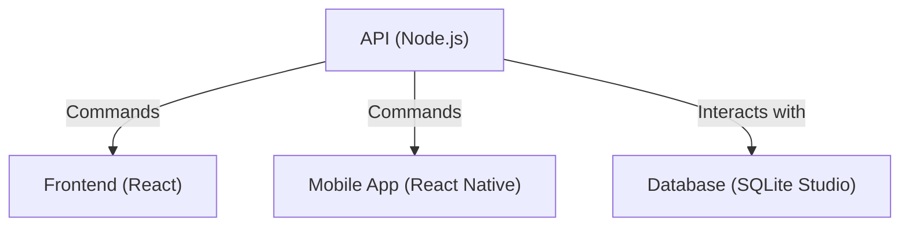
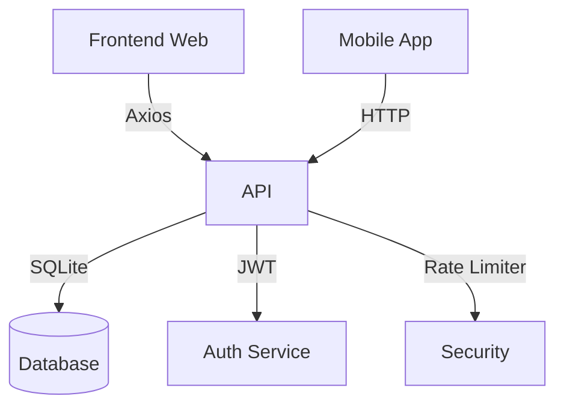
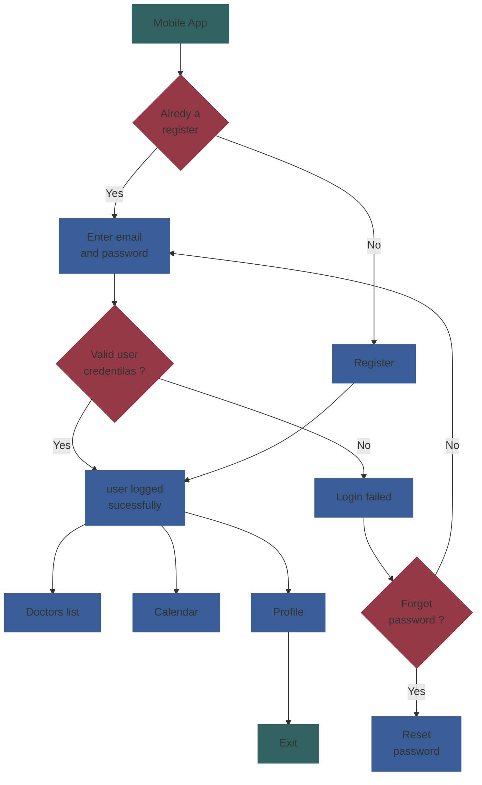
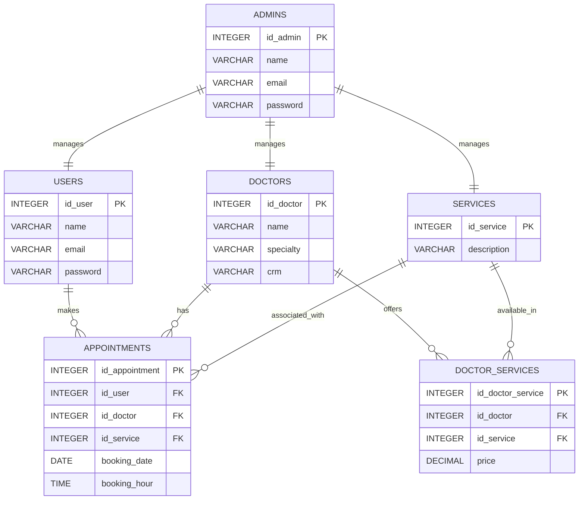

# Dragenda - Doctor agenda - Medical Appointment Management

Digital healthcare revolutionizes the way we deliver and experience healthcare with a paradigm shift to more accessible, personalized and efficient approaches for all. **Dragenda** is an online version of the medical appointment management system, allowing patients to schedule, modify or cancel medical appointments effortlessly. By eliminating the need for in-person visits to schedule appointments, these patient appointment system platforms enable patients to conveniently book and manage their appointments online.

[](https://react.dev/)
[](https://reactnative.dev/)
[](https://nodejs.org/)
[](https://www.sqlite.org/)
[](https://expo.dev/)

## Architecture



A modern cross-platform application for managing medical appointments, built with cutting-edge technologies to streamline healthcare scheduling.

## ✨ Features

### Patient Features

- 🗓️ Intuitive appointment scheduling
- 👨⚕️ Doctor/service selection with real-time availability
- 📱 Mobile-first responsive design (iOS/Android)
- 🔐 JWT-based authentication
- 📅 Interactive appointment calendar

### Admin Features

- 📊 Comprehensive dashboard
- 👥 User/doctor management
- 📈 Appointment analytics
- ⚙️ Service configuration
- 🔔 Push notifications

## Components



## 🛠️ Technical Stack

### Frontend Applications

| Component        | Technology       | Key Dependencies                      |
|------------------|------------------|---------------------------------------|
| Web Client       | React 18         | react-router-dom, axios, vite         |
| Mobile Client    | React Native 0.76| expo, react-navigation, async-storage |
| State Management | Context API      | react-native-calendars, moment        |

### Backend Services

| Component        | Technology       | Key Dependencies               |
|------------------|------------------|--------------------------------|
| API Server       | Node.js/Express  | bcrypt, jsonwebtoken, sqlite3  |
| Database         | SQLite           | express-rate-limit, cors       |
| Authentication   | JWT              | dotenv                         |

## App flow to user



## 🚀 Getting Started

### Prerequisites

- Node.js 18+
- npm 9+
- Expo CLI (for mobile)
- SQLite Studio 3.4+

### Installation

1. Clone repository:

```bash
git clone https://github.com/mateusribeirocampos/dragenda.git
cd dragenda
```

Please read our Contribution Guidelines and Code of Conduct.

### Dependencies for each component

```bash
# API
cd dragenda-api && npm install

# Web Client
cd ../dragenda-web && npm install

# Mobile Client
cd ../dragenda-mobile && npm install
```

### Configuration

API(.env)

```env
JWT_SECRET=your_secure_secret
PORT=0000
```

Web Client(.env)

```env
REACT_APP_API_URL=http://localhost:0000
```

Mobile Clinet(app.config.js)

```javascrit
extra: {
  API_URL: process.env.API_URL || 'http://localhost:3001',
}
```

### Running the Application

```bash
cd dragenda-api && node --trace-warnings --watch src/index.js
```

### Start Web Client

```bash
cd dragenda-web && npm run dev
```

### Start Mobile Client

```bash
cd dragenda-mobile && npx expo start
```

## Database Diagram



### 🤝 Contributing

#### Fork the repository

#### Create feature branch

```bash
git checkout -b feature/amazing-feature
Commit changes:
````

```bash
git commit -m "feat: add amazing feature"
Push to branch:
````

```bash
git push origin feature/amazing-feature
Open Pull Request
```

## 📄 License

This project is licensed under GNU AFFERO GENERAL PUBLIC LICENSE -
see [LICENSE](https://github.com/mateusribeirocampos/dragenda/tree/main?tab=AGPL-3.0-1-ov-file) file for details.

## 🙏 Acknowledgments

UI components powered by [React Bootstrap](https://react-bootstrap.netlify.app/)

Authentication system based on [JWT](https://jwt.io/introduction) best practices
